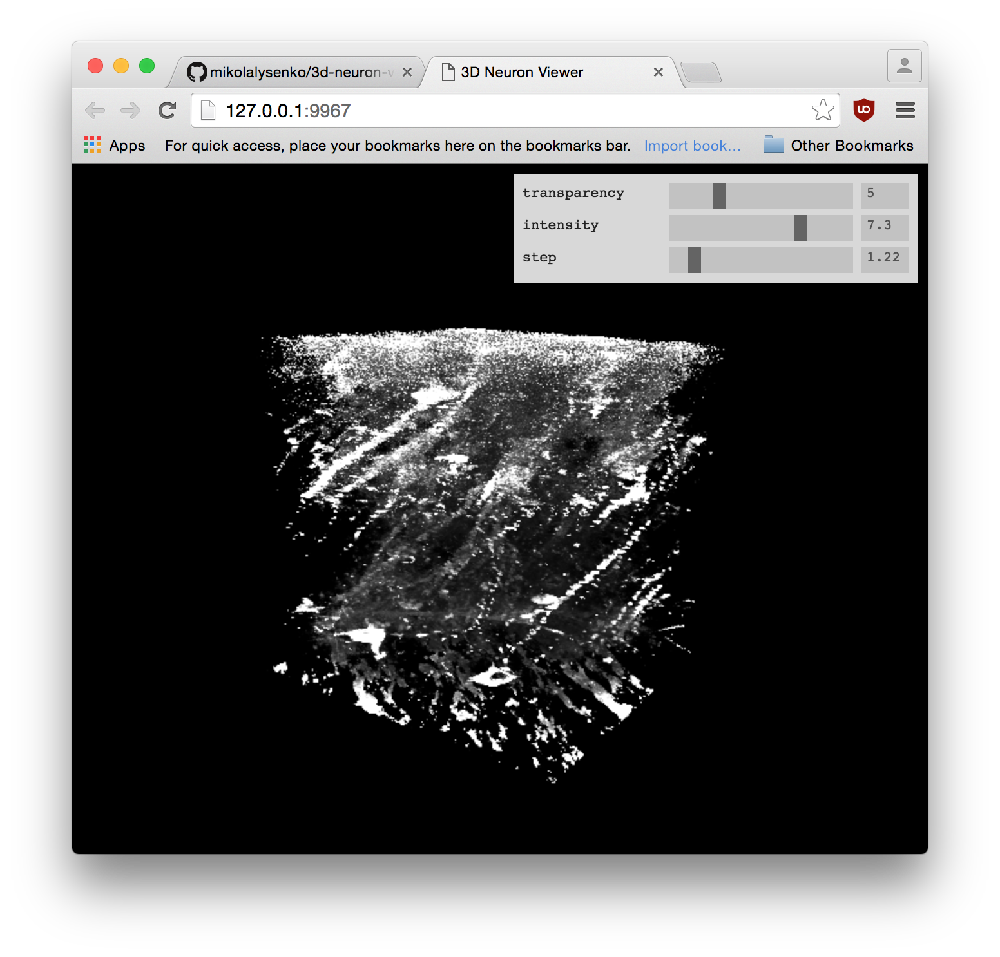

[3d-neuron-viewer](http://mikolalysenko.github.io/3d-neuron-viewer/)
================

Renders a scan of some mouse neurons in 3D.

Credits
=======
(c) 2014-2016 Mikola Lysenko. MIT License

Mouse neuron data from @sofroniewn
